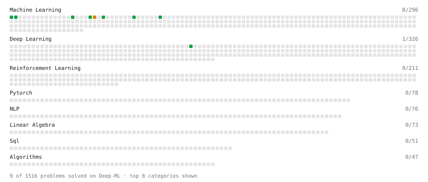

# Deep-ML

My machine learning practice from [Deep-ML](https://www.deep-ml.com). Every solution here was written by hand.

**9** solved · 9 problems · 0 labs · 0 math

[**Browse the interactive portfolio**](https://scaredofthesix.github.io/deep-ml/) to replay this filling in over time.

## Problems

| | Difficulty | Solved | |
| --- | --- | --- | --- |
| [Binary Classification with Logistic Regression](https://www.deep-ml.com/problems/104) | easy | 2026-10-05 | [solution](problems/0104-binary-classification-with-logistic-regression) |
| [Calculate Accuracy Score](https://www.deep-ml.com/problems/36) | easy | 2026-10-05 | [solution](problems/0036-calculate-accuracy-score) |
| [Generate a Confusion Matrix for Binary Classification](https://www.deep-ml.com/problems/75) | easy | 2026-10-05 | [solution](problems/0075-generate-a-confusion-matrix-for-binary-classification) |
| [Implement Precision Metric](https://www.deep-ml.com/problems/46) | easy | 2026-10-05 | [solution](problems/0046-implement-precision-metric) |
| [Implement Recall Metric in Binary Classification](https://www.deep-ml.com/problems/52) | easy | 2026-10-05 | [solution](problems/0052-implement-recall-metric-in-binary-classification) |
| [Linear Regression Using Gradient Descent](https://www.deep-ml.com/problems/15) | easy | 2026-10-03 | [solution](problems/0015-linear-regression-using-gradient-descent) |
| [Linear Regression Using Normal Equation](https://www.deep-ml.com/problems/14) | easy | 2026-10-03 | [solution](problems/0014-linear-regression-using-normal-equation) |
| [Momentum Optimizer](https://www.deep-ml.com/problems/146) | easy | 2026-10-05 | [solution](problems/0146-momentum-optimizer) |
| [Implement Gradient Descent Variants with MSE Loss](https://www.deep-ml.com/problems/47) | medium | 2026-10-03 | [solution](problems/0047-implement-gradient-descent-variants-with-mse-loss) |

---

_This file is regenerated by Deep-ML on every push._
